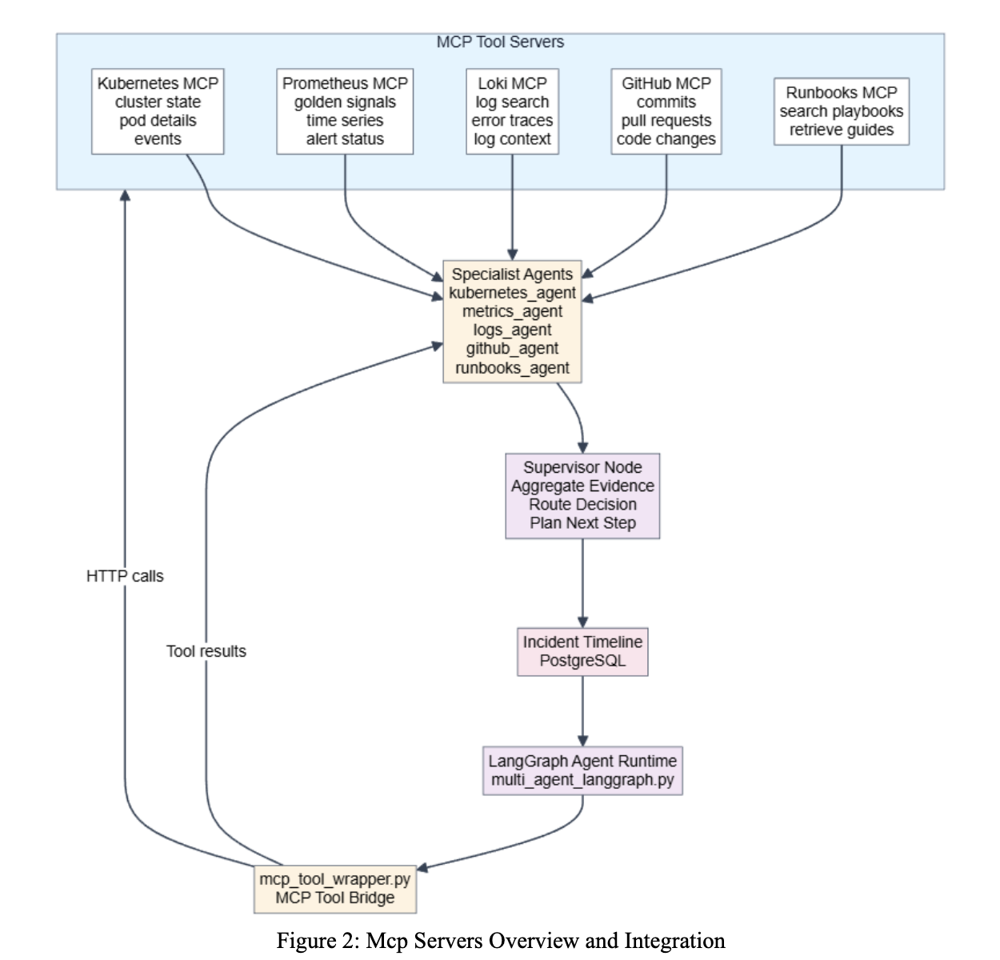

# Multi DevOps Copilot — AI Incident Response System

I built this to answer one question: can an AI agent do what an on-call SRE does at 3am — look at logs, metrics, Kubernetes state, recent code changes, and figure out what broke and why?

The answer is yes.

When a production alert fires, this system automatically investigates it. It pulls live data from Kubernetes, Prometheus, Loki, and GitHub in parallel, reasons over the evidence using a multi-agent LangGraph loop, and writes a full investigation transcript you can read, follow up on, and audit. Everything is persisted. Nothing gets lost after the incident closes.

## YouTube link : https://youtu.be/sveEBodKCbs 

## System Architecture

### Layer Architecture



The system is split into four independent layers:

1. **Platform control plane** — manages identities, clusters, incidents, jobs, and the agent runtime
2. **Dashboard** — gives operators a live UI for incident transcripts, audit trails, and cluster state
3. **Edge MCP servers** — expose live infrastructure (K8s, Prometheus, Loki, GitHub, Runbooks) as tools to the agent
4. **Target Client** — generates realistic traffic, failures, and observability signals for the demo

The dashboard talks to the backend through Next.js rewrites. The agent runtime uses the MCP layer to gather live evidence. The backend owns persistence and identity, not the reasoning flow itself.

**Key semantics:**
- Arrows show request and evidence flow, not startup dependency order
- Dashboard is a client of the API — no reverse dependency
- Target Client produces incidents and observability signals
- Edge MCP servers expose infrastructure as tools to the agent
- Agent reasoning and persistence happen in the platform layer

### MCP Servers Overview and Integration



Five MCP tool servers expose live infrastructure to the agent — Kubernetes cluster state, Prometheus golden signals, Loki logs and traces, GitHub commits and pull requests, and Runbooks for playbook retrieval. Specialist agents call these servers via HTTP, get tool results back through the MCP Tool Bridge (`mcp_tool_wrapper.py`), and feed findings up to the Supervisor Node which aggregates evidence, routes decisions, and persists everything to the Incident Timeline in PostgreSQL. The LangGraph Agent Runtime (`multi_agent_langgraph.py`) orchestrates the full loop.

### Backend Data Model



The backend persists organizations, users, clusters, incidents, timeline events, jobs, audit trails, and SLOs. The incident timeline event table is the core — each row is one step in the investigation. The `pending_supervisor` field marks events eligible for human follow-up.

### Additional Architecture Diagrams

| Diagram | What It Shows |
|---|---|
| [MCP Integration](docs/architecture/images/mcp-integration.svg) | How the agent connects to edge tool servers |
| [MCP Evidence Sequence](docs/architecture/images/mcp-evidence-sequence.svg) | Evidence gathering flow per investigation |
| [Incident Investigation Loop](docs/architecture/images/incident-investigation-loop.svg) | Full OODA loop the agent runs |
| [Incident Follow-up Sequence](docs/architecture/images/incident-followup-sequence.svg) | How human follow-up questions are handled |
| [Job Queue System](docs/architecture/images/job-queue-system.svg) | Async job lifecycle |
| [Auth Flow](docs/architecture/images/auth-flow.svg) | JWT auth and RBAC |
| [Target Client Architecture](docs/architecture/images/target-client-architecture.svg) | Simulated K8s workload layout |
| [Platform Bootstrap](docs/architecture/images/platform-bootstrap.svg) | Service startup order and dependencies |

## Tech Stack

**Agent & Backend**
- Python 3.12, FastAPI, LangGraph, LangChain
- PostgreSQL (SQLAlchemy async), Redis, Qdrant (vector memory)
- Alembic migrations, JWT auth, bcrypt password hashing

**Frontend**
- Next.js, TypeScript
- API rewrites for transparent backend proxy

**Infra & Observability**
- Docker Compose, Kubernetes (Docker Desktop)
- Prometheus, Loki, Grafana, Alertmanager

**LLM**
- Pluggable: Ollama (local), Groq, Google Gemini, NVIDIA NIM
- Automatic fallback chain if primary provider fails

## Quick Start

### Prerequisites
- Docker Desktop with **Kubernetes enabled**
- A supported LLM backend (Ollama locally or an API key for Groq/Gemini/NVIDIA)

### 1. Configure environment

```bash
cp .env.example .env
# fill in LLM_PROVIDER and the matching API key
```

```bash
cp edge_mcp_servers/.env.example edge_mcp_servers/.env
# fill in GITHUB_TOKEN and GITHUB_REPO
```

Minimum values to set in `.env`:
- `LLM_PROVIDER` — `ollama`, `groq`, `gemini`, or `nvidia`
- The matching key: `GROQ_API_KEY`, `GOOGLE_API_KEY`, `NVIDIA_API_KEY`, or `OLLAMA_BASE_URL`
- `SECRET_KEY` — any random string for JWT signing

### 2. Start everything

```bash
bash main_start.sh
```

This runs in order:
1. `Target_Client/start.sh` — builds and deploys the demo K8s workload
2. `platform/start.sh` — starts Postgres, Redis, Qdrant, the agent API, and the dashboard
3. `edge_mcp_servers/start.sh` — starts the MCP tool servers

### 3. Open the dashboard

- **Dashboard**: http://localhost:3002 — login: `admin@example.com` / `admin`
- **API Docs**: http://localhost:8080/docs
- **Chaos Panel**: http://localhost:8888
- **Grafana**: http://localhost:3001
- **Prometheus**: http://localhost:9090

### 4. Inject a demo alert

```bash
bash inject_alerts.sh
```

Fires a realistic Prometheus-style alert every 5 minutes. Watch the agent investigate it live on the dashboard.

### 5. Stop everything

```bash
bash main_Stop.sh
```

## Repository Map

| Path | What It Contains |
|---|---|
| `platform/` | Docker Compose stack — API, dashboard, Postgres, Redis, Qdrant |
| `sre_agent/` | LangGraph multi-agent runtime, supervisor, MCP integration |
| `backend/` | FastAPI routes, SQLAlchemy models, auth, CRUD, seed |
| `dashboard/` | Next.js operator UI |
| `edge_mcp_servers/` | MCP servers for K8s, Prometheus, Loki, GitHub, Runbooks |
| `Target_Client/` | Simulated K8s workload — services, load generator, chaos panel |
| `tests/` | Integration and unit tests |
| `docs/architecture/` | Architecture diagrams (SVG) |

## Development

### Platform only (no K8s workload)

```bash
cd platform && docker compose up -d --build
```

### Dashboard development

```bash
cd dashboard && npm ci && npm run dev
```

### Run tests

```bash
pytest
cd dashboard && npm run lint
python Target_Client/testing/test_layer0.py
python Target_Client/testing/test_layer1.py
```

## Troubleshooting

- **Dashboard loads but API fails** — check `API_URL` in `platform/docker-compose.yaml` points to `http://sre-agent-api:8080`
- **Agent starts but can't reason** — check `LLM_PROVIDER` and confirm the backend is reachable
- **No metrics in platform** — verify Prometheus and Loki are on the host ports the MCP servers expect
- **Admin login fails** — confirm seed script ran and `SEED_ADMIN_PASSWORD` matches your `.env`
- **413 token error on Groq** — switch to `llama-3.1-8b-instant` (higher free tier TPM limit)
